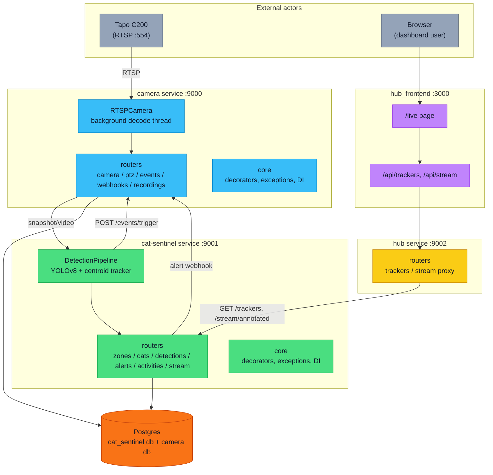
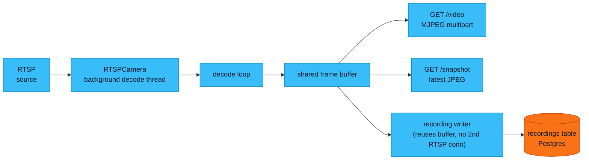
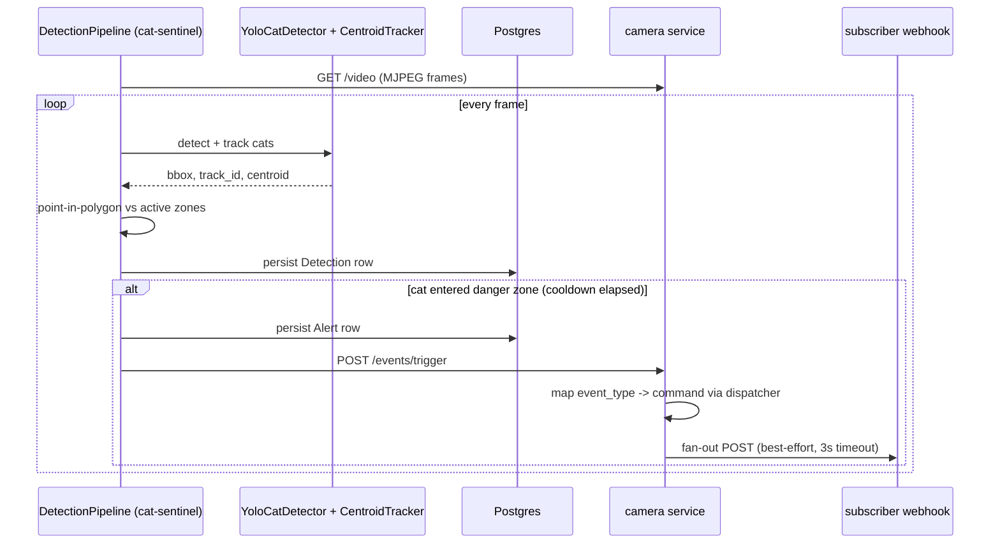

# cat_sentinel

A system that watches a room via camera and alerts when a **cat** enters a
"danger zone" (e.g. the table next to a pet's terrarium). Four independent services,
each its own Poetry/npm project, orchestrated locally by [`tools/dev.sh`](tools/dev.sh).

```
cat_sentinel/
├── camera/          # RTSP -> HTTP bridge + PTZ control (port 9000 in dev)
├── cat-sentinel/     # cat detection/tracking via YOLOv8 (port 9001 in dev)
├── hub/              # central aggregator API for the frontend (port 9002 in dev)
├── hub_frontend/      # Next.js dashboard, consumes hub (port 3000)
├── docker/            # docker-compose for Postgres (two databases: cat_sentinel, camera)
├── docs/               # ADRs
└── tools/dev.sh         # brings up Postgres + all four services locally
```

Hardware target: **TP-Link Tapo C200**. RTSP on port 554, PTZ control via `pytapo`. PTZ is
open-loop (no real position feedback), so angles are estimated locally and drift -- see
[`camera/app/ptz/service.py`](camera/app/ptz/service.py) and `POST /ptz/calibrate` to resync.

## Architecture



## Stream pipeline (camera service)



## Detection & alert sequence



## Local dev

```bash
cp docker/.env.example docker/.env
./tools/dev.sh
```

This brings up Postgres (two databases: `cat_sentinel`, `camera`) and all four services.
See each service's own README for its `.env` and `poetry install` / `npm install` steps.

## Docs

- [`docs/adr/0001-layered-fastapi-architecture.md`](docs/adr/0001-layered-fastapi-architecture.md)
- [`docs/adr/0002-camera-api-scope-boundary.md`](docs/adr/0002-camera-api-scope-boundary.md)
